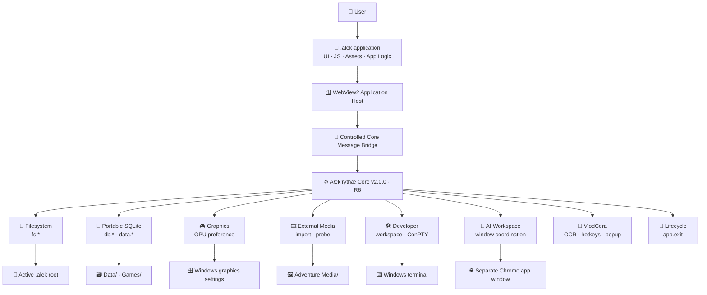
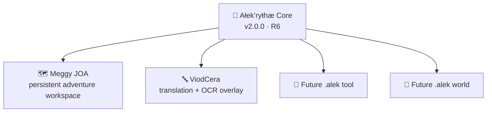

<div align="center">

# 🌌 Ałek’ryŧhæ Core

### **The native Windows runtime behind the `.alek` ecosystem**

A self-contained host for portable `.alek` applications, combining **WebView2**, **SQLite**, controlled native bridges, graphics selection, media access, developer tooling, data transfer, AI-window integration, and application lifecycle services behind one runtime boundary.

<br>

[](#-release-v200)
[](https://github.com/TheDEvorger/Alekrythae-Core/actions/workflows/build.yml)
[](#-versioning)
[](#-requirements)
[](#-requirements)
[](#-runtime-model)
[](#-portable-data-layer)

<br>

> ## **One Core. Many `.alek` applications. One controlled native boundary.**

**Application logic stays with the application.  
Native Windows capabilities stay behind Core APIs.  
Portable worlds stay close to the files that own them.**

<br>

[**Why Core**](#-why-core-exists) ·
[**Architecture**](#-architecture) ·
[**Capabilities**](#-capability-map) ·
[**Portable Data**](#-portable-data-layer) ·
[**ViodCera**](#-viodcera-runtime-support) ·
[**Developer Bridge**](#-developer-bridge) ·
[**Security Model**](#-trust-boundaries) ·
[**Build**](#-build) ·
[**API Surface**](#-core-api-surface) ·
[**Release**](#-release-v200)

</div>

---

# ✦ The idea

A `.alek` application can own its interface, assets, JavaScript, world logic, tools, lore, workflows, and user experience.

It should not have to become a Windows runtime at the same time.

**Ałek’ryŧhæ Core exists to separate those responsibilities.**

The application describes *what the experience is*.  
Core provides the native services that experience may safely request.

```text
┌───────────────────────────────────────────────────────────┐
│                    .alek application                      │
│                                                           │
│   UI · JavaScript · assets · world logic · app behavior   │
└────────────────────────────┬──────────────────────────────┘
                             │
                             │ controlled bridge
                             ▼
┌───────────────────────────────────────────────────────────┐
│                    Ałek’ryŧhæ Core                         │
│                                                           │
│  Windows · WebView2 · SQLite · Files · GPU · Media · API  │
└───────────────────────────────────────────────────────────┘
```

The result is a runtime where portable application content and native platform responsibilities can evolve without being fused into one monolith.

> **The `.alek` file is the doorway. Core is the machinery behind the door.**

---

# 🧭 Why Core exists

Desktop applications eventually collide with native concerns.

Even an application whose visible surface is built with web technology still needs answers to questions such as:

- Where does persistent data live?
- Who owns database creation and migration?
- How are files read and written without exposing the whole machine?
- How are interrupted writes handled?
- How does an app select a GPU?
- How does external media enter the application safely?
- How can a development workspace use a real Windows terminal?
- How does an application request a native exit?
- How can an AI browser window be visually integrated without turning the application into a browser credential reader?
- How can data travel between installations without blindly copying a live SQLite database?

Core is the answer layer for those questions.

Instead of making every `.alek` application reinvent platform code, Core centralizes the shared native responsibilities and exposes them through explicit bridges.

---

# ⚖️ The boundary

| The `.alek` application owns | Ałek’ryŧhæ Core owns |
|---|---|
| User experience | Native host lifecycle |
| UI and layout | WebView2 hosting |
| JavaScript application logic | Controlled native bridge |
| Assets and application resources | Root-scoped filesystem operations |
| World / tool / workflow behavior | SQLite persistence services |
| App-specific data model | Native data-transfer plumbing |
| App-specific media usage | External-media approval and probing |
| App-specific graphics UI | Windows GPU preference integration |
| App-specific developer UX | Workspace and ConPTY services |
| Exit/farewell experience | Final native process exit |
| AI workspace presentation | External window coordination |

This separation is intentional.

Core should be powerful enough to host serious applications without gradually swallowing the applications themselves.

---

# ⚡ Capability map

| Capability | What Core provides |
|---|---|
| 🌀 **`.alek` runtime** | Windows association and direct launch of `.alek` applications. |
| 🪟 **WebView2 host** | Desktop application surface backed by Microsoft Edge WebView2. |
| 🧱 **Root-scoped filesystem bridge** | File operations constrained around the active `.alek` root. |
| 💾 **Portable SQLite layer** | Registry and Adventure databases stored beside the application ecosystem. |
| ⚛️ **Atomic writes** | Same-directory temporary writes followed by atomic replacement on supported paths. |
| 📦 **`.alekdata` transfer** | Snapshot-based export/import with SHA-256 verification and rollback protection. |
| 🎮 **Graphics bridge** | Adapter discovery and persisted Windows graphics preference. |
| 🎞️ **External-media bridge** | Controlled import/probing for supported audio, video, and image formats. |
| 🛠️ **Developer bridge** | Workspace APIs plus Windows ConPTY-backed terminal sessions. |
| 🤖 **AI workspace dock** | Visual coordination of a separate Chrome application-mode window. |
| 🌙 **ViodCera bridge** | Resident hotkeys, OCR selection, translation-window support, and ViodCera lifecycle integration. |
| 💤 **Runtime power management** | Reduced WebView2 pressure while the host is inactive. |
| 🚪 **Lifecycle API** | Explicit application-to-host exit request through `app.exit`. |
| 🔁 **R6 compatibility line** | Stable established API namespaces and portable storage behavior. |

---

# 🏛️ Architecture



The architectural center is not WebView2, SQLite, or WPF by itself.

It is the **bridge contract** between portable application code and native services.

---

# 🌀 Runtime model

The normal runtime flow is intentionally small from the user's point of view:

```text
Double-click a .alek file
          │
          ▼
   Ałek’ryŧhæ Core
          │
          ▼
Resolve application root
          │
          ▼
Open WebView2 host
          │
          ▼
Expose approved Core APIs
          │
          ▼
Application becomes active
```

A `.alek` application can therefore behave like a desktop application while retaining a file-centered application identity.

When Core itself is launched without a `.alek` argument, it performs its registration work and exits instead of remaining as an unnecessary idle launcher process.

---

# 🧬 Core components

```text
src/Alekrythae.Core/
│
├── Program.cs
│   └── process lifecycle, startup and .alek association
│
├── CosmicGate.cs
│   └── primary runtime window and WebView2/Core message bridge
│
├── ViodCeraBridge.cs
│   └── ViodCera resident behavior, hotkeys, OCR and popup bridge
│
├── PortableGameStore.cs
│   └── portable SQLite persistence
│
├── DataTransferService.cs
│   └── .alekdata export, import and migration
│
├── GraphicsBridge.cs
│   └── adapter discovery and Windows graphics preference
│
├── ExternalMediaBridge.cs
│   └── approved media selection, import and probing
│
├── DeveloperBridge.cs
│   └── controlled development workspace operations
│
├── ConPtySession.cs
│   └── native Windows pseudo-terminal integration
│
├── EdgeChatGptDock.cs
│   └── external AI workspace window coordination
│
├── CoreUninstaller.cs
│   └── cleanup / uninstall workflow
│
└── Resources/
    └── icons, artwork and runtime resources
```

Each component exists for a different native responsibility.

The application should not need to know how those responsibilities are implemented internally. It should need only the bridge contract it is allowed to call.

---

# 💾 Portable Data Layer

Portability is not a slogan in Core. It is a storage decision.

A typical `.alek` root can keep runtime state close to the application:

```text
<alek-root>/
│
├── <dimension>.alek
│
├── Data/
│   └── meggy.db
│
├── Games/
│   └── <adventure>/
│       ├── game.db
│       └── Media/
│
└── application resources...
```

`PortableGameStore` deliberately avoids making the main application/game state depend on unrelated user-profile storage such as:

```text
AppData/
Documents/
Temp/
```

That gives the ecosystem a much clearer ownership model:

> **Application files belong to the application.  
> Live world data belongs beside the world.**

---

## Why portable storage matters

### 📁 Predictable ownership

A developer can understand which data belongs to which application without reverse-engineering profile folders.

### 🧳 Easier movement

The application root retains meaning when copied, archived, moved, or inspected.

### 🛟 Clearer recovery

Backups and transfer tools can target known stores instead of hunting through unrelated machine state.

### 🧬 Controlled migration

Schema and application changes can be handled through explicit migration paths.

---

# 🗃️ SQLite persistence

The Core database layer supports the persistent operations needed by compatible `.alek` applications.

Established database behavior includes workflows for:

```text
registry reads / writes
game creation
document reads / writes
existence checks
deletion
rename operations
portable database storage
```

The application defines its own domain.

Core provides the native persistence machinery beneath it.

This distinction matters because JOA, ViodCera, and future `.alek` applications do not need to share the same product logic merely because they share the same host.

---

# 🛡️ Data Safety & Transfer

Persistent worlds deserve safer write behavior than “copy the file and hope.”

Core's R6 line strengthens storage and transfer around several principles.

---

## ⚛️ Atomic filesystem writes

Supported write paths use a staged write pattern:

```text
application write request
          │
          ▼
create unique temporary file
          │
          ▼
write beside destination
          │
          ▼
replace destination atomically
          │
          ▼
clean temporary file
```

Current protected paths include supported:

```text
fs.writeText
fs.writeJson
fs.writeBinary
runtime memory writes
```

If the temporary operation fails, Core attempts to clean up the temporary artifact.

The goal is simple: reduce the probability that an interrupted operation leaves the destination half-written.

---

## 📦 `.alekdata` packages

Core's transfer layer is designed to move compatible user data without treating a live database like an ordinary static document.

Safeguards include:

- export from a consistent SQLite snapshot,
- **SHA-256** package verification,
- conflict-aware Adventure import,
- rollback package creation before import,
- compatibility handling,
- migration recognition for legacy JSON,
- SQLite source recognition,
- support for older Meggy ZIP-style sources.

```text
Live data
   │
   ├─ create consistent snapshot
   │
   ├─ package
   │
   ├─ hash / verify
   │
   └─ export
          │
          ▼
      .alekdata
          │
          ▼
   validate import
          │
   ├─ preserve rollback
   ├─ resolve conflict
   └─ activate compatible data
```

> **Move the world without gambling with the live world.**

---

# 🧱 Filesystem bridge

A desktop runtime is only useful if applications can work with files.

It is only trustworthy if “file access” does not automatically mean “the whole machine is yours.”

Core's filesystem bridge is built around the active `.alek` root.

The application requests supported operations through the bridge, and those operations are constrained to the runtime's application context.

Conceptually:

```text
C:\
├── Users\
├── Windows\
├── Other Projects\
└── My Alek App\
    ├── App.alek        ← active application
    ├── Assets\         ← application-owned
    ├── Data\           ← application-owned
    └── Games\          ← application-owned
```

The intended application surface is the final subtree, not arbitrary machine-wide navigation.

This boundary is part of the runtime architecture.

---

# 🎮 Graphics & GPU Preference

Complex WebView2 applications can be visually demanding.

`GraphicsBridge` gives `.alek` applications a native route to inspect and manage the Windows graphics preference without embedding Windows-specific graphics logic into every application.

Supported operations include:

```text
listGraphicsAdapters
setGraphicsPreference
getGraphicsPreference
openWindowsGraphicsSettings
```

The persisted preference is also used when Core builds the WebView2 browser arguments for the runtime.

This gives the application a clean division:

```text
Application
    └─ asks for graphics preference

Core
    └─ understands Windows graphics preference
```

---

# 🎞️ External Media Bridge

A persistent application may need to work with media selected from outside its own root.

Core handles that boundary through a controlled import/probe workflow.

### Audio

```text
MP3 · M4A · AAC · WAV · OGG · OPUS · FLAC · WMA
```

### Video

```text
MP4 · WEBM · MOV
```

### Image

```text
PNG · JPG/JPEG · WEBP · GIF · BMP · SVG · AVIF
```

The intended lifecycle is:

```text
external user-selected file
            │
            ▼
       Core approval
            │
            ▼
       media probing
            │
            ▼
 application-controlled import
            │
            ▼
 Adventure / Media-owned copy
```

An original arbitrary absolute source path is not intended to become a permanent world-state dependency.

That distinction keeps a portable Adventure from quietly depending on a random file that happened to exist elsewhere on one machine.

---

# 🛠️ Developer Bridge

Core is not only a player/runtime host.

R6 also exposes a dedicated `dev.*` surface for tooling and development workflows.

```text
dev.status

dev.workspace.pick
dev.workspace.release
dev.workspace.list
dev.workspace.readText
dev.workspace.writeText
dev.workspace.exists
dev.workspace.mkdir

dev.shell.start
dev.shell.write
dev.shell.resize
dev.shell.stop
```

---

## ⌨️ Native terminal sessions

Developer terminal sessions are backed by **Windows ConPTY**.

They use UTF-8 streams and support Unicode Windows paths.

That detail matters.

Ałek’ryŧhæ projects are not required to pretend the world ends at plain ASCII filenames.

```text
Workspace
   │
   ├─ controlled file API
   │
   └─ ConPTY session
          │
          ├─ start
          ├─ write
          ├─ resize
          └─ stop
```

The developer bridge is intentionally separate from the ordinary application APIs so tooling can evolve without casually widening every application's native surface.

---

# 🤖 AI Workspace Dock

Some `.alek` applications can visually integrate an external AI workspace.

Core does this by coordinating a separate **Google Chrome application-mode window**.

The browser remains its own process with its own browser profile.

Core's role is window integration:

- position,
- bounds,
- visual docking,
- lifecycle coordination.

The bridge is not designed to read:

```text
page DOM
browser cookies
saved passwords
network traffic
browser session keys
```

That is a crucial boundary.

> **Dock the window, not the user's browser identity.**

Google Chrome is optional and is only needed by applications that use this external AI-window workflow.

---

# 🌙 ViodCera Runtime Support

Core v2.0.0 includes the native bridge required by **Alekrythae-ViodCera.alek**.

The bridge is activated only for the ViodCera application identity/file name so ordinary `.alek` applications keep their normal behavior.

ViodCera support brings a different kind of workload into the ecosystem: a resident translation/OCR utility that needs global interaction without behaving like a conventional foreground application.

---

## ViodCera native capabilities

Core provides the native side required for:

- resident hotkeys,
- selected-text translation flow,
- live OCR-region selection,
- local Windows OCR integration,
- no-activate translation popup behavior,
- ViodCera window lifecycle,
- application font scaling support,
- hidden resident operation while keeping WebView2 warm.

### Runtime controls

```text
Ctrl + Q       selected-text translation
Alt + Q        live OCR selection
Space / Enter  confirm OCR region
Esc            cancel OCR selection
Ctrl + Wheel   application font scaling
```

The OCR selection surface is designed to remain transparent rather than intentionally dimming or freezing the screen.

The ViodCera host can remain resident while hidden, allowing the WebView2 environment to stay warm for faster popup use.

---

## Why ViodCera lives behind Core

A browser UI alone cannot cleanly own global hotkeys, resident native window behavior, local Windows OCR, and no-activate popup coordination.

That is exactly the kind of boundary Core exists to handle.

```text
ViodCera.alek
     │
     │ translation / OCR UI
     ▼
WebView2 application
     │
     │ ViodCera bridge
     ▼
Ałek’ryŧhæ Core
     │
     ├─ hotkeys
     ├─ OCR selection
     ├─ native window behavior
     └─ lifecycle
```

ViodCera remains a `.alek` application.

Core remains the native host.

---

# 🚪 Application Lifecycle

Applications should not need to terminate the Core process through hacks.

The established lifecycle surface includes:

```text
app.exit
```

That allows a `.alek` application to own the user-facing exit experience first.

For example:

```text
user requests exit
      │
      ▼
application confirmation
      │
      ├─ save / animation / farewell
      │
      ▼
    app.exit
      │
      ▼
Core closes native host
```

JOA's Blue Moon exit sequence is a good example of why this separation is useful: the application controls the experience, while Core controls the actual native process lifecycle.

---

# 💤 Runtime Power Management

A desktop host should not behave as though every visual surface is foreground-critical forever.

Core includes runtime behavior intended to reduce unnecessary WebView2 memory and power pressure while an application is inactive.

The purpose is not to silently shut down application logic.

It is to make the host more respectful of machine resources when full foreground pressure is unnecessary.

---

# 🔐 Trust Boundaries

Core has access to native Windows capabilities.

That makes the boundary design more important, not less.

The runtime is built around explicit surfaces rather than a single “give the application everything” switch.

---

## Files

Application file operations are scoped around the active `.alek` root.

## Media

External paths enter through a deliberate selection/import flow.

## Browser / AI workspace

The docking layer coordinates an external browser window but is not designed as a DOM, cookie, password, traffic, or session-token extractor.

## Data transfer

Imports are validated, conflict handling exists, and rollback protection is part of the transfer workflow.

## Developer tools

Development workspace and terminal behavior live in the dedicated `dev.*` surface rather than being silently exposed as ordinary application APIs.

---

# 🧪 Runtime contract mindset

Core should be treated as a host contract.

A compatible application should depend on documented bridge behavior, not on accidental implementation details inside Core.

That means a `.alek` application should prefer:

```text
documented Core operation
```

over:

```text
assumption about Core internals
```

This is what lets the runtime evolve without requiring every application to be rewritten whenever implementation details change.

---

# 🔌 Core API Surface

The established R6 API families include:

```text
fs.*
db.*
data.*

Graphics / GPU operations
External media operations
AI operations

dev.*

app.exit
```

Individual applications may use only part of that surface.

---

## Example: JOA integration surface

Ałek’ryŧhæ · Meggy JOA uses Core services including:

```text
app.exit

fs.readText

listGraphicsAdapters
setGraphicsPreference

pickExternalMedia
probeExternalMedia

safeAi.open
safeAi.bounds
safeAi.close
```

This is the intended ecosystem pattern.

JOA does not need to *become* Core.

Core does not need to *become* JOA.

---

# 🌌 Ecosystem

Ałek’ryŧhæ Core is designed as common infrastructure beneath multiple `.alek` applications.



The runtime is shared.

The identities of the applications are not.

That is the point.

---

# 🧪 JOA Runtime Target

Core v2.0.0 is the target runtime for:

> **Ałek’ryŧhæ · Meggy JOA v1.0.0**

JOA uses Core as its native foundation for portable storage, filesystem access, graphics integration, media workflows, SafeAI window coordination, and host lifecycle behavior.

The two projects have deliberately different responsibilities:

| JOA | Core |
|---|---|
| Adventure/world application | Native runtime |
| Mevcudat | Filesystem bridge |
| Map and travel | Portable SQLite |
| Character systems | Graphics preference |
| Tavern | Media bridge |
| Cartography | SafeAI/window integration |
| App-specific persistence model | Native persistence services |
| Blue Moon exit UX | `app.exit` host closure |

This division keeps both projects easier to reason about.

---

# 🪟 Requirements

## Runtime

- **Windows 10 version 2004 or later**
- **Windows x64**
- **Microsoft Edge WebView2 Runtime**

Google Chrome is only required for the optional external AI workspace docking workflow.

---

## Build environment

- **Windows x64**
- **.NET 10 SDK**
- **Microsoft Edge WebView2 Runtime**

---

# 📚 Main dependencies

| Package | Version | Role |
|---|---:|---|
| `Microsoft.Data.Sqlite` | `10.0.12` | Managed SQLite access |
| `SQLitePCLRaw.bundle_e_sqlite3` | `2.1.13` | SQLite native bundle |
| `Microsoft.Web.WebView2` | `1.0.4191.47` | Embedded application runtime |

---

# 🧪 Tests and CI

The repository includes an MSTest project for Core behavior and portable SQLite persistence.

Run the full test suite from the repository root:

```powershell
dotnet test Alekrythae.sln --configuration Release
```

GitHub Actions automatically restores, builds, and tests the solution on Windows with .NET 10 for pushes, pull requests, and manual runs. The CI run also collects Cobertura-compatible coverage data and publishes the test results as a short-lived workflow artifact.

Current automated checks cover, among other things:

- unsupported bridge-operation contracts
- registry and game database schema creation
- game metadata upsert behavior
- portable media-folder creation
- document write/read/exists round trips
- document-history preservation on updates
- game rename/delete behavior
- Windows reserved-name and document-key validation

---

# 🔨 Build

Clone the repository and run the supplied release build from the repository root:

```bat
BUILD_CORE.cmd
```

The build restores required dependencies and publishes a self-contained Windows x64 release to:

```text
release/Alekrythae-Core-v2.0.0-Windows-x64/
```

Expected output includes:

```text
Alekrythae Core.exe
Alekrythae Core.runtimeconfig.json
Alekrythae Core.deps.json
```

For source-level performance verification followed by the normal build:

```bat
BUILD_CORE_PERF.cmd
```

---

# ▶️ Run

Once Core has registered the `.alek` association, the normal user flow is simply:

```text
<application>.alek
      │
      │ double click
      ▼
Ałek’ryŧhæ Core
      │
      ▼
application root resolved
      │
      ▼
application opens
```

No permanent launcher needs to sit idle in the background simply to wait for an `.alek` file.

---

# 🗂️ Repository Layout

```text
.
│
├── .github/
│   ├── workflows/
│   │   └── build.yml
│   └── dependabot.yml
│
├── src/
│   └── Alekrythae.Core/
│       ├── Program.cs
│       ├── CosmicGate.cs
│       ├── ViodCeraBridge.cs
│       ├── PortableGameStore.cs
│       ├── DataTransferService.cs
│       ├── GraphicsBridge.cs
│       ├── ExternalMediaBridge.cs
│       ├── DeveloperBridge.cs
│       ├── ConPtySession.cs
│       ├── EdgeChatGptDock.cs
│       ├── CoreUninstaller.cs
│       └── Resources/
│
├── tests/
│   └── Alekrythae.Core.Tests/
│       ├── DataTransferServiceTests.cs
│       ├── PortableGameStoreSchemaTests.cs
│       ├── PortableGameStoreDocumentTests.cs
│       ├── PortableGameStoreLifecycleTests.cs
│       ├── PortableGameStoreTestSupport.cs
│       └── TestInfrastructureTests.cs
│
├── Alekrythae.sln
├── BUILD_CORE.cmd
├── BUILD_CORE_PERF.cmd
├── LICENSE
├── SECURITY.md
├── VERSION
└── .gitignore
```

Runtime-generated material is intended to stay out of source control.

That includes machine-local data such as databases, caches, temporary files, logs, backups, and private environment material.

---

# 🧹 Repository Hygiene

A runtime repository should not become a scrapbook of machine-local state.

Keep material such as the following out of source control:

```text
.env
private keys
credential files
browser profiles
session tokens

runtime databases
WAL / SHM state
temporary exports
logs
build caches
machine-local paths
```

Source code, runtime contracts, and intentional resources belong in the repository.

User state does not.

---

# 🧬 Versioning

Ałek’ryŧhæ Core separates **public release identity** from the **internal Core revision line**.

```text
Release version : v2.0.0
Core revision   : R6
Display version : Ałek’ryŧhæ Core v2.0.0 (R6)
```

Public releases follow Semantic Versioning-style tags:

```text
vMAJOR.MINOR.PATCH
```

Internal Core architecture lineage uses:

```text
R#
```

The two values answer different questions.

**v2.0.0** tells users which public release they have.

**R6** identifies the underlying Core revision lineage.

---

# 🏁 Release · v2.0.0

Ałek’ryŧhæ Core **v2.0.0** is the current public release of the R6 runtime line.

It brings the established Core architecture together as the native foundation for the modern `.alek` ecosystem.

### Core runtime foundations

- `.alek` file association and launch flow
- WebView2 desktop host
- root-scoped filesystem bridge
- portable SQLite persistence
- atomic write protection
- `.alekdata` transfer safeguards
- graphics-adapter discovery
- Windows graphics preference integration
- external media import/probing
- developer workspace bridge
- Windows ConPTY terminal integration
- external AI workspace docking
- runtime power-management behavior
- native lifecycle APIs

### v2.0.0 ecosystem support

- **Ałek’ryŧhæ · Meggy JOA v1.0.0** target runtime
- **ViodCera** native hotkey/OCR/window bridge
- stable R6 compatibility lineage
- synchronized `v2.0.0` release identity across the current Core line

---

# 🧭 Design Philosophy

## 1 · Native power should have a boundary

Running on desktop should not mean application code receives unrestricted machine access by default.

---

## 2 · Portable data should actually be portable

A world is not portable when its important state is invisibly scattered across unrelated profile folders.

---

## 3 · Safety belongs below the application

Atomic writes, controlled import, scoped paths, and native lifecycle behavior are stronger when the host enforces them consistently.

---

## 4 · Core should not become every application

JOA should remain JOA.

ViodCera should remain ViodCera.

Future `.alek` applications should be free to develop their own identity.

Core exists to give them native capabilities without absorbing them.

---

## 5 · Compatibility is part of the product

A runtime becomes useful when applications can rely on its contracts.

Stable namespaces and clear boundaries matter as much as features.

---

## 6 · Native complexity should be paid once

If ten `.alek` applications require the same Windows capability, the ecosystem should not need ten unrelated implementations of that capability.

Core is where shared native complexity belongs.

---

# ❓ FAQ

<details>
<summary><strong>What exactly is a <code>.alek</code> application?</strong></summary>

A `.alek` application is an application package/entry point hosted by Ałek’ryŧhæ Core. The application owns its UI, JavaScript, assets, behavior, and domain logic, while Core provides the approved native Windows services it needs.

</details>

<details>
<summary><strong>Is Ałek’ryŧhæ Core itself JOA?</strong></summary>

No. JOA is one `.alek` application in the ecosystem. Core is the runtime beneath it.

</details>

<details>
<summary><strong>Is ViodCera built into every application?</strong></summary>

No. Core contains ViodCera-specific native bridge support, but that bridge is activated only for the ViodCera application identity/file name. Normal `.alek` behavior remains unchanged.

</details>

<details>
<summary><strong>Where does application data live?</strong></summary>

The portable model keeps runtime stores such as `Data/` and `Games/` beside the active `.alek` root rather than making application state depend on unrelated profile directories.

</details>

<details>
<summary><strong>Does the AI workspace dock read browser passwords or cookies?</strong></summary>

The docking layer is designed for window placement and lifecycle integration. It is not designed to read page DOM, cookies, passwords, network traffic, or browser session keys.

</details>

<details>
<summary><strong>Why use SQLite?</strong></summary>

SQLite gives compatible `.alek` applications a compact local persistent store while fitting Core's portable-file model.

</details>

<details>
<summary><strong>Does an application get unrestricted access to Windows files?</strong></summary>

The Core filesystem bridge is designed around the active `.alek` root rather than an unrestricted machine-wide filesystem surface.

</details>

<details>
<summary><strong>Why is there both v2.0.0 and R6?</strong></summary>

`v2.0.0` is the public release identity. `R6` identifies the internal Core revision lineage.

</details>

<details>
<summary><strong>What happens when Core is opened without a .alek file?</strong></summary>

Core performs its registration work and exits instead of remaining as an idle background launcher.

</details>

<details>
<summary><strong>Can developer tools use a real terminal?</strong></summary>

Yes. The developer bridge provides terminal sessions backed by Windows ConPTY with UTF-8 streams and Unicode-path support.

</details>

---

# 📜 License

Ałek’ryŧhæ Core is proprietary source-available software. The repository does not grant an open-source license. See [`LICENSE`](LICENSE) for the repository terms. Third-party components remain subject to their own licenses.

For licensing or commercial-use permission, contact **thedevorger.alekrythae.dev@gmail.com**.

---

# 🌠 The ecosystem direction

Ałek’ryŧhæ Core is not intended to end as a launcher for one project.

Its architecture points toward an ecosystem where specialized applications can share a reliable native foundation:

```text
                         🌌
                 Ałek’ryŧhæ Core
                      v2.0.0
                         │
          ┌──────────────┼──────────────┐
          │              │              │
          ▼              ▼              ▼
      Meggy JOA       ViodCera      Future .alek
       worlds        translation       tools
          │              │              │
          └──────────────┼──────────────┘
                         │
               controlled native APIs
                         │
             portable application roots
```

The applications can change.

The worlds can change.

The interfaces can change.

The native boundary remains something they can build upon.

---

<div align="center">

<br>

# 🌙 Ałek’ryŧhæ Core

### **Build the experience in `.alek`. Keep the native machinery in Core.**

<br>

`v2.0.0` · `R6` · `.NET 10` · `WPF` · `WebView2` · `SQLite` · `Windows x64`

<br>

### **One Core. Many `.alek` applications. One evolving software ecosystem.**


</div>


---

© 2026 TheDEvorger. All rights reserved.

Ałek’ryŧhæ, Ałek’ryŧhæ Core, `.alek`, and related project names, software components, documentation, visual identity, and original ecosystem concepts are part of the Ałek’ryŧhæ project.

Unauthorized copying, redistribution, modification, republication, or commercial use of this software and its documentation is prohibited except where explicitly permitted by the repository license.

For licensing and legal inquiries:

**thedevorger.alekrythae.dev@gmail.com**